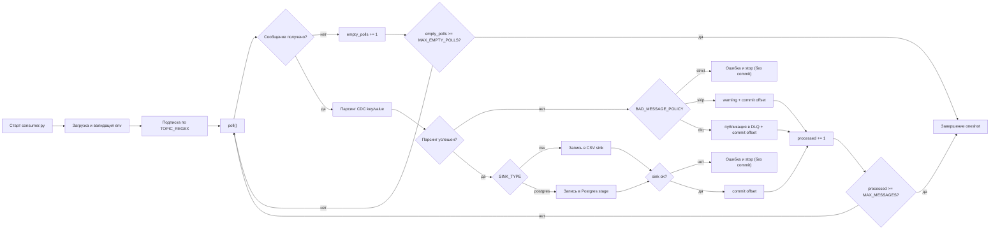
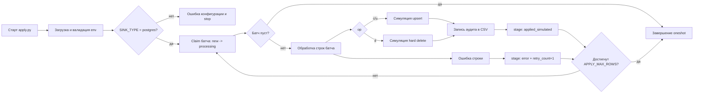

# Runtime Flow

_Обновлено вручную через процесс Codex: 2026-04-13._

## Контекст
- `ingest`: `consumer.py` (`oneshot`, regex-подписка по `TOPIC_REGEX`)
- `apply`: `apply.py` (`oneshot`, stage -> simulated apply)
- `sink_type`: `csv | postgres`
- `bad_message_policy`: `strict | skip | dlq`

## Схема 1. Ingest (consumer.py)

Комментарий:
- offset коммитится только после успешной записи в sink;
- если sink упал, процесс завершается без commit текущего offset.

## Схема 2. Apply (apply.py)

Комментарий:
- apply читает только stage-строки со статусом `new`;
- для `op=d` выполняется симуляция hard delete;
- на ошибке строка маркируется как `error`, offset Kafka не участвует.

## Короткая легенда
- `new` / `processing` / `applied_simulated` / `error` — статусы строк в stage.
- `commit offset` есть только в ingest-контуре consumer.
- apply-контур работает по данным из stage, а не по offset Kafka.

## Примечания
- Файл поддерживается через процесс Codex, а не runtime-кодом сервиса.
- При изменении пайплайна обновлять вместе с `README.md`, `components.md`, `CHANGELOG.md`.
